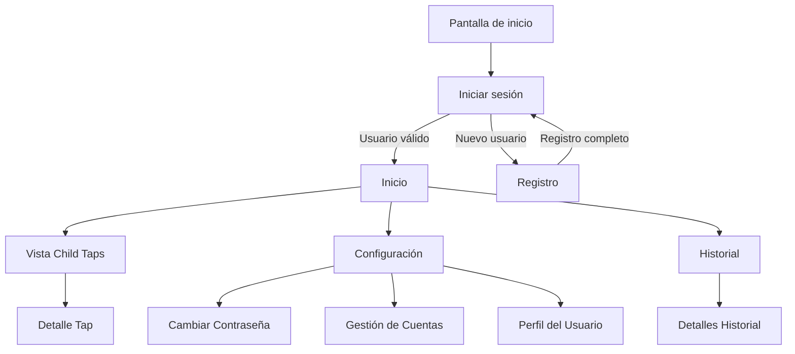
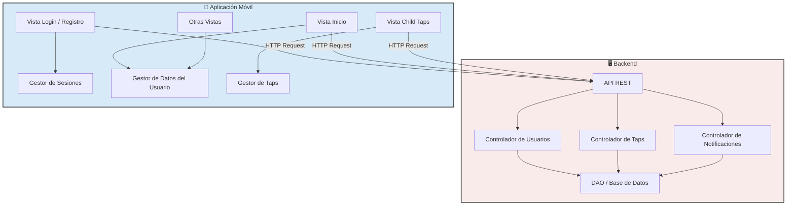
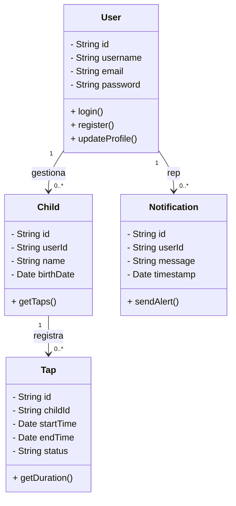

# Prototipo 2 - TapatApp

## Introducción
En el desarrollo de aplicaciones móviles, los wireframes y los bocetos (mockups) son herramientas fundamentales para definir la estructura y la navegación de la interfaz de usuario.

## 1. Wireframes: Flujo de Navegación y Descripción de Vistas
El siguiente diagrama muestra el árbol de navegación de toda la aplicación. Se indica el flujo básico sin entrar en la lógica interna de cada vista:

---

## 2. Descripción de las Vistas

## 1. Pantalla de inicio
- **Descripción**: Pantalla inicial que se muestra cuando el usuario abre la aplicación. Presenta el logotipo y puede incluir una animación breve mientras se carga la configuración inicial.
- **Info. Entrada**: No hay entrada, es la pantalla de bienvenida.
- **Info. Vista**: Logotipo de la aplicación, animaciones (si las hay).

## 2. Iniciar sesión
- **Descripción**: Pantalla donde el usuario introduce sus credenciales para acceder a la aplicación.
- **Info. Entrada**: Username o email, Password.
- **Info. Vista**: Token de sesión (opcional, necesario para realizar el login automático).

## 3. Inicio
- **Descripción**: Pantalla principal de la aplicación que muestra la información relevante del tratamiento, accesos directos a otras vistas y notificaciones recientes.
- **Info. Entrada**: Datos del usuario y del niño asociado (recuperados desde la base de datos).
- **Info. Vista**: Estado del tratamiento, notificaciones recientes, accesos a "Child Taps", "Configuración" y "Historial".

## 4. Registro
- **Descripción**: Pantalla donde el usuario puede crear una nueva cuenta. Incluye un formulario para introducir los datos básicos.
- **Info. Entrada**: Nombre de usuario, email, contraseña.
- **Info. Vista**: Mensajes de validación en tiempo real para los campos introducidos.

## 5. Vista Child Taps
- **Descripción**: Vista dedicada a mostrar los registros de uso del parche para el niño. Permite iniciar, detener y revisar el tiempo acumulado.
- **Info. Entrada**: Información sobre el niño (edad, etc.).
- **Info. Vista**: Tiempo de uso del parche (relativo o absoluto, dependiendo de la edad del niño), opciones para gestionar el tiempo.

## 6. Configuración
- **Descripción**: Vista donde el usuario puede ajustar diversas opciones de la aplicación, como notificaciones, sincronización con el servidor y configuración de la cuenta.
- **Info. Entrada**: Preferencias del usuario para la configuración.
- **Info. Vista**: Opciones de configuración (notificaciones, cuenta, sincronización).

## 7. Historial
- **Descripción**: Pantalla que muestra un registro cronológico de todas las actividades y usos del parche, con opciones de filtrado.
- **Info. Entrada**: Datos de uso anteriores, filtrados por fechas o estado.
- **Info. Vista**: Lista de registros de uso del parche con detalles como duración y fecha.

## 8. Cambiar Contraseña
- **Descripción**: Vista que permite al usuario cambiar su contraseña actual.
- **Info. Entrada**: Contraseña actual, nueva contraseña.
- **Info. Vista**: Confirmación de la actualización de la contraseña.

## 9. Gestión de Cuentas
- **Descripción**: Vista donde el usuario puede gestionar sus cuentas (en caso de multiusuario) y editar sus datos personales.
- **Info. Entrada**: Información personal (nombre, email, etc.).
- **Info. Vista**: Opciones para editar y guardar cambios en los datos personales.

## 10. Detalle Tap
- **Descripción**: Vista detallada de un registro de uso de parche específico. Muestra información sobre la duración y otros detalles importantes.
- **Info. Entrada**: Datos del registro seleccionado.
- **Info. Vista**: Hora de inicio, hora de finalización, duración, comentarios o incidencias.

## 11. Detalles Historial
- **Descripción**: Pantalla con detalles más profundos sobre un registro específico del historial de tratamiento.
- **Info. Entrada**: Registro seleccionado.
- **Info. Vista**: Metadatos del registro seleccionado para un análisis más profundo del tratamiento.

---

## 3. Diagrama de Arquitectura del Prototipo 2
Este diagrama muestra la comunicación básica entre el cliente (aplicación móvil) y el servidor (backend) a través de API REST. Se contempla la interacción con la base de datos para la gestión de usuarios, registros de taps y notificaciones.

---

## 4. Diagrama de Clases (Backend y Front-End)
Este diagrama representa las clases principales que se utilizarán tanto en el backend como en el frontend.

---

## 5. Implementación

### Áreas Clave de la Implementación

#### Vistas:

- **Login y Registro**: Desarrollo de la interfaz de autenticación y validación de campos.
- **Vista Child Taps**: Implementación para seguir el uso del parche, diferenciando entre tiempo relativo (para niños < 6 meses) y tiempo absoluto (para niños ≥ 6 meses).
- **Otras Vistas**: Desarrollo de vistas como Home, Configuración, Historial y Detalle Tap.

#### API Backend:

- **Gestión de Usuarios**: Endpoints para login, registro, actualización de perfil y recuperación de contraseña.
- **Gestión de Taps**: API para crear y actualizar registros de uso del parche.
- **Notificaciones**: Sistema de alertas automáticas según los datos de los taps.

#### Integración Frontend-Backend:

- **Comunicación REST API**: Peticiones HTTP para recuperar o actualizar datos de manera asíncrona.
- **Gestores de Sesiones y Datos**: Lógica de interacción con los datos usando librerías como Retrofit (para Android).

#### Pruebas y Validación:

- **Testing**: Pruebas unitarias e integradas para asegurar la correcta comunicación entre frontend y backend.
- **Validación con Usuario**: Fase piloto con usuarios reales para ajustar parámetros.

#### Despliegue y Escalabilidad:

- **Servidor de Producción**: Configuración de un servidor seguro y escalable.
- **Opción Web**: Desarrollo de una interfaz web complementaria para gestión adicional.